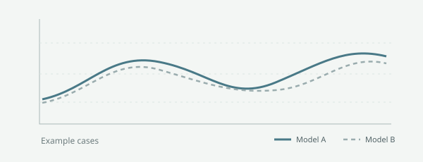

This unpublished example verifies inline math such as $\Delta_i$ and a display equation:

$$
\Delta_i = \hat{\theta}_{i,A} - \hat{\theta}_{i,B}.
$$

*Figure 1. A schematic illustration with no empirical data.*
